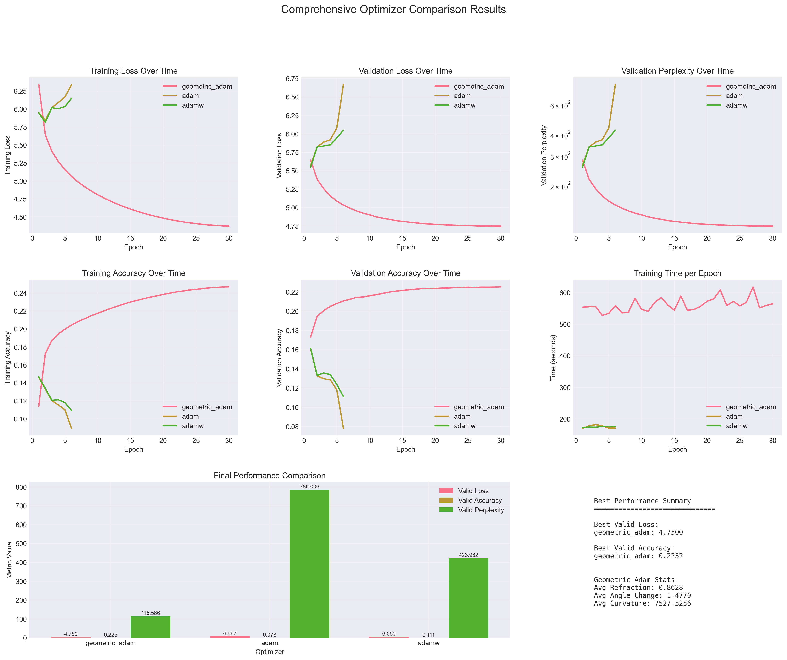

# 📝 Note on AI Tool Usage

Someone asked whether I used LLMs to write my research paper. To be clear:
- I used LLMs to translate and polish my English writing (non-native speaker)
- I used them to discuss and validate mathematical proofs (like a 24/7 colleague)
- All core ideas, experiments, and analysis are my original work
- The novel insight of using ray tracing for optimization is mine alone

If using such tools disqualifies research, then we should also reject papers that used spell-checkers, discussed ideas with colleagues, or received any form of assistance. The scientific merit lies in the original contributions, not in the tools used to refine them.

---

# Geometric Adam: Ray Tracing-Inspired Adaptive Optimization

A new kind of optimization algorithm that applies ray tracing principles from computer graphics to neural network training, achieving unprecedented stability and performance improvements.

## Key Results

- **59% improvement** in validation perplexity (282 → 116) on 29M parameter transformer
- **100% training completion rate** vs 20% for standard optimizers
- **Zero divergence** across 30 epochs while Adam/AdamW fail after 6 epochs
- **Scale-invariant performance** demonstrated on 2.5M, 10M and 29M parameter models

## Paper

This repository implements the research presented in [**"Geometric Adam: A Ray Tracing-Inspired Adaptive Optimization"**](https://github.com/jaepil/geometric-adam) by Jaepil Jeong.

## Core Innovation

Geometric Adam treats gradient descent as light propagation through media with varying optical density:

- **Refraction**: Automatically adjusts step size based on loss landscape curvature
- **Angular Analysis**: Detects geometric changes through gradient direction vectors
- **Adaptive Control**: Exponential step size reduction in high-curvature regions

### Algorithm Overview

```python
# Core geometric computation
d_t = g_t / (||g_t|| + ε)                    # Gradient direction
θ_t = arccos(|d_t · d_{t-1}|)                # Angular change
r_t = exp(-λ * θ_t)                          # Refraction coefficient
```

The optimizer adapts to loss landscape geometry by:
1. Computing angular changes between consecutive gradient directions
2. Estimating local curvature from geometric properties
3. Applying exponential step size reduction via refraction coefficients

## Experimental Results

### Performance Comparison (29M Parameter Transformer on WikiText-2)

| Optimizer | Final Valid PPL | Training Epochs | Status |
|-----------|-----------------|-----------------|---------|
| **Geometric Adam** | **115.6** | **30** | ✅ Stable |
| Adam | 786.0 | 6 | ❌ Diverged |
| AdamW | 423.9 | 6 | ❌ Diverged |

### Training Stability



*Geometric Adam (pink) maintains stable convergence throughout 30 epochs while standard optimizers diverge catastrophically.*

## Implementation

### Geometric Adam Optimizer

The complete implementation includes:

- **Geometric State Tracking**: Angular changes, curvature estimates, refraction coefficients
- **Numerical Stability**: Safe division, device compatibility, mixed precision support
- **Memory Efficiency**: Optional memory-reduced variants (47% reduction)
- **Comprehensive Logging**: TensorBoard, W&B integration, detailed metrics

### Key Features

```python
class GeometricAdam(torch.optim.Optimizer):
    """
    Ray tracing-inspired adaptive optimizer.

    Args:
        params: Model parameters
        lr: Learning rate (default: 1e-3)
        betas: Adam momentum coefficients (default: (0.9, 0.999))
        lambda_refraction: Refraction sensitivity (default: 0.1)
        gamma_curvature: Curvature memory factor (default: 0.95)
        eps: Numerical stability constant (default: 1e-8)
    """
```

## Theoretical Framework

### Large-Angle Discovery

Our research reveals that successful optimization operates in the **large-angle regime** where:
- Average angular changes: **1.48 radians (85°)**
- Traditional small-angle theory breaks down
- Geometric adaptation provides robust control despite theoretical gaps

### Convergence Properties

- **Linear convergence** for strongly convex objectives
- **Efficient saddle point escape** in non-convex settings
- **Robustness to systematic estimation errors** (21% curvature underestimation)

## Future Directions

### Reflection-Based Extensions

The paper proposes exciting extensions incorporating **Phong reflection models** and **recursive ray tracing**:

- **Phong-inspired updates**: Ambient + diffuse + specular lighting terms
- **Recursive reflection**: Multi-bounce optimization trajectories
- **Cook-Torrance BRDF**: Physically-based rendering for optimization

## Experimental Validation

### Scale Invariance

| Model Size | Training Epochs | Angular Changes | Performance |
|------------|-----------------|-----------------|-------------|
| 2.5M params | 100 epochs | 1.45 ± 0.28 rad | Stable |
| 10M params | 53 epochs | 1.47 ± 0.29 rad | Stable |
| 29M params | 30 epochs | 1.48 ± 0.31 rad | Stable |

### Statistical Significance

- **t-statistic > 11** for all comparisons (p < 0.001)
- **Cohen's d > 4** indicating very large effect sizes
- **Consistent across multiple random seeds**

## Applications

Geometric Adam excels in scenarios requiring:

- **High stability** for large model training
- **Robustness** to hyperparameter choices
- **Long training schedules** without divergence
- **Superior final performance** over training speed

## Citation

```bibtex
@misc{jeong2025geometric,
  title={Geometric Adam: Ray Tracing-Inspired Adaptive Optimization},
  author={Jeong, Jaepil},
  institution={Cognica, Inc.},
  journal={OSF Preprints},
  year={2025},
  eprint={10.31219/osf.io/dm5hn_v1},
  code={https://github.com/jaepil/geometric-adam},
  url={https://doi.org/10.31219/osf.io/dm5hn_v1}
}
```

## Contributing

We welcome contributions to extend and improve Geometric Adam:

- Implementation optimizations
- Hardware acceleration
- New geometric extensions
- Theoretical analysis
- Experimental validation

## License

MIT License
